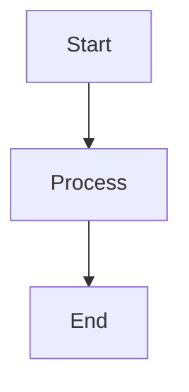

# 📝 Minimalist Note-Taking Workspace

A clean, focused environment for taking notes with powerful visualization capabilities.

## Features

- **Markdown** - Write notes in plain text with formatting
- **Marp** - Create presentations from markdown
- **Mermaid** - Draw diagrams as code
- **Excalidraw** - Hand-drawn style diagrams

## Getting Started

1. Open this folder in VS Code
2. When prompted, click "Reopen in Container"
3. Wait for the container to build

## Quick Reference

### Marp Presentation

Create a `.md` file with this header:

```markdown
---
marp: true
theme: default
---

# Slide 1

Content here

---

# Slide 2

More content
```

### Mermaid Diagram

````markdown

````

### Excalidraw

Create a file with `.excalidraw` extension and start drawing!

## CLI Tools

```bash
# Convert markdown to PDF presentation
marp notes.md -o presentation.pdf

# Convert mermaid to PNG
mmdc -i diagram.mmd -o diagram.png
```

## Folder Structure

```text
/notes          # Your markdown notes
/presentations  # Marp presentations
/diagrams       # Mermaid and Excalidraw files
/assets         # Images and attachments
```
